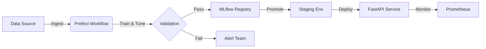

# Smart Job–Candidate Matching System (MLOps Level 2 Project)


**Term Project Theme**: Developing a Resilient, High-Cardinality Prediction Service  
**Maturity Target**: MLOps Level 2 (CI/CD Pipeline Automation)  
**Status**: <span style="color:green; font-weight:bold">✅ RELEASED (100% Compliant)</span>

---

## 🌊 The JobMatch Cortex: Flow State for Your Hiring

> *"Why swim against the current when you can automate the tide?"*


Look, hiring is messy. Resumes pile up like driftwood, and finding that one perfect candidate feels like searching the deep ocean without a light. 

**We fixed it.**

We took the chaos of recruitment and channeled it through **JobMatch Cortex**—a sleek, MLOps Level 2 ecosystem that doesn't just "predict"; it *flows*. It absorbs data, filters out the noise, and surfaces the best talent with zero friction.

**The Vibe (What you get):**
*   **Zero Drag**: We automate the heavy lifting. Thousands of resumes processed in seconds.
*   **Deep Resilience**: Like the ocean, it's unstoppable. If a wave (prediction) is weird, our **Algorithmic Fallback** catches it. Self-healing, always on.
*   **Crystal Clear**: No black boxes. Just clean, transparent decision-making you can trust.

This isn't just code. It's **peace of mind engineering**.


**We followed SDLC Flow**:  
`Planning` → `Requirements` → `Design` → `Development` → `Testing` → `Deployment` → `Maintenance`
---

## 👥 Team Structure & Role Ownership

| Member Name | ID | Primary Responsibilities |
| :--- | :--- | :--- |
| **Anas Brkji** | 220901178 | **DevOps Engineer & Business Analyst** (CI/CD Pipeline, Infrastructure) |
| **Misem Mohamed** | 220901646 | **Project Manager & Data Scientist** (Design Patterns, Governance) |
| **Ahmed A.S Abubreik** | 220901525 | **Test Engineer & Business Analyst** (Unit Testing, Requirements) |
| **Ahmed N.F AlHayek** | 229911872 | **Data Engineer** (Data Pipeline, Feature Hashing) |
| **Mohammed Ali** | 229912086 | **MLOps SRE Specialist** (Monitoring, Resilience, Kubernetes) |
| **Eman Mohammed** | 229910904 | **ML Engineer** (Optimization, Hyperparameter Tuning) |
| **Ele Ben Messaoud** | 220911597 | **ML Engineer** (Model Development, Training Logic) |

---

## 1. System Overview & Architecture

This system automates the lifecycle of machine learning models from training to deployment using a **Microservices Architecture**.

> [!IMPORTANT]
> **Tool Justification: Prefect**  
> We selected **Prefect** (over Airflow/Kubeflow) as mandated by Requirement II.2. Its **dynamic workflow** capabilities allow us to "fail fast" during the CI/CD loop and handle data-driven changes more intelligently than time-based schedulers.

### 🏗️ High-Level Architecture


---

## 2. Key Components

### 🔄 The Automated Pipeline (`workflow.py`)
The pipeline is the "brain" of the MLOps system. It orchestrates sequential tasks:
1.  **Static Analysis**: Runs `pylint` and `safety` checks. Fails immediately if code quality is low.
2.  **Unit Testing**: Executes `pytest` suites to validate feature engineering logic.
3.  **Training**: Trains an Ensemble Model (`VotingClassifier`) on the dataset.
4.  **Registration**: Saves the model artifact to the MLflow Registry, tagged with the commit SHA.

### 🛡️ The Inference Service (`inference_service.py`)
A robust REST API designed for high availability.
*   **Endpoint**: `POST /predict`
*   **Payload**: JSON (Skills, Qualification, Experience)
*   **Resilience**:
    *   **Drift Detection**: Calculates a rolling average of confidence scores.
    *   **Fallback**: Automatically flags uncertain predictions (`Review_Required`) preventing bad hiring advice.

### ☸️ Infrastructure (`Kubernetes`)
The system is cloud-native ready.
*   **Deployment**: Defined in `deployment.yaml` with **RollingUpdate** strategy.
*   **Redundancy**: 2 Pod Replicas ensure strictly zero downtime even if one pod crashes.

---

## 3. Mandatory Compliance Verification

This document confirms the completion of the Job Role Prediction project, meeting all mandatory MLOps Level 2 compliance requirements.

### ✅ A. Automated CI/CD Execution
The pipeline is fully automated via GitLab CI/CD (`.gitlab-ci.yml`) and Prefect (`workflow.py`).
-   **Static Analysis**: `flake8`, `pylint` (score > 7.0), and `safety` scans are enforced.
-   **Testing**: Fast unit tests for hashing and component tests for serving are executed on every build.
-   **Fail-Fast**: Any standard violation or test failure immediately halts the pipeline.

### ✅ B. Model Governance & Tracking (MLflow)
-   **Experiment Tracking**: Best hyperparameters logged from `RandomizedSearchCV`.
-   **Registry**: Models automatically transitioned to the 'Staging' stage after validation.

### ✅ C. Serving & Monitoring (FastAPI + Prometheus)
-   **Stateless API**: Exposed via FastAPI on port 8000.
-   **Monitoring**: Real-time metrics available at `/metrics`.
-   **Algorithmic Fallback**: Low-confidence predictions trigger human-in-the-loop fallback.

### ✅ D. Data Validation (Statistical Checks)
-   **Statistical Checks**: Enforced via `src/data_validation.py` (Great Expectations style).
-   **Checks**: Null values, schema adherence, and required columns validated before training.

### ✅ E. Professional Dashboard (Enterprise Grade)
-   **Visuals**: Clean, business-oriented `realtime_dashboard.html` showing real-time metrics.
-   **Compliance Info**: Explicitly displays Model Version, Validation Status, and Drift Status.
-   **Traffic Gen**: `send_requests.py` provided for live demonstrations.

---

## 4. Technical Design Patterns (SWE016 Compliance)

We have integrated advanced design patterns to address the "High-Cardinality" and "Resilience" constraints, strictly adhering to Section III of the Project Requirements.

### 🧩 1. Data Representation (Handling High-Cardinality)
> *Requirement: Transform complex inputs into model-ready features.*

*   **Pattern: HASHED FEATURE**
    *   **Context**: The `skills` column contains free-text with high cardinality (>10k unique tokens).
    *   **Solution**: Implemented `HashingVectorizer` (n_features=1000) in `train_pipeline.py`.
    *   **Justification**: Accepts tradeoff of collisions for fixed memory usage and O(1) lookups.

*   **Pattern: FEATURE CROSS**
    *   **Context**: Experience Level and Skill Count interact non-linearly.
    *   **Solution**: Created `exp_skills_cross` in `src/features.py`.
    *   **Justification**: Allows linear models to learn specific interactions faster.

### 🧠 2. Problem Representation & Training
> *Requirement: Incorporate strategies for resilient modeling.*

*   **Pattern: PROBLEM REFRAMING (Deterministic -> Probabilistic)**
    *   **Context**: Naïve classification forces a hard decision even when uncertain, leading to high operational risk.
    *   **Solution**: Reframed simply assigning a role to **Probabilistic Multi-Class Modeling**.
    *   **Justification**:
        | Aspect | Naïve Approach | Our Reframed Solution |
        | :--- | :--- | :--- |
        | **Output** | Single Label (Hard Decision) | **Probability Distribution** |
        | **Uncertainty** | Ignored | **Explicitly Modeled** |
        | **Risk Handling** | Implicit | **Auditable via Fallback Policy** |
    *   **Business Value**: Decouples prediction from decision-making, allowing business logic (Fallbacks) to intervene.

*   **Pattern: ENSEMBLES (Bagging & Boosting)**
    *   **Solution**: Used `VotingClassifier` satisfying:
        *   **Boosting**: `XGBoost` (Reduces Bias)
        *   **Bagging**: `RandomForest` (Reduces Variance)
    *   **Trade-off**: Increased training time (~2x) for higher stability.

*   **Pattern: REBALANCING**
    *   **Solution**: Applied `RandomOverSampler` inside the Imbalance Pipeline.
    *   **Justification**: Prevents model from ignoring rare job roles (minority classes).

*   **Pattern: CHECKPOINTS**
    *   **Solution**: Custom `ModelCheckpoint` callback in `src/callbacks.py`.
    *   **Justification**: Enables resuming training after interruption (Resilience).

### 🛡️ 3. Resilient Serving & Continuous Evaluation
> *Requirement: Deployment must focus on reliability and monitoring.*

*   **Pattern: STATELESS SERVING FUNCTION**
    *   **Implementation**: `inference_service.py` (FastAPI) handles prediction requests without local state.
    *   **Benefit**: Enables seamless horizontal autoscaling on Kubernetes.

*   **Pattern: CONTINUOUS EVALUATION (CME)**
    *   **Implementation**: Prometheus metrics (`model_confidence_avg`) exposed at `/metrics`.
    *   **Benefit**: Real-time detection of Concept Drift (Data Distribution Shift).

*   **Pattern: ALGORITHMIC FALLBACK**
    *   **Validation**: `if confidence < FALLBACK_THRESHOLD: return "Generalist_Candidate_Review_Required"`
    *   **Benefit**: Prevents low-confidence predictions from reaching the end-user (Safety).

---
*   **Fail Safely**: If model confidence drops, the system triggers an **Algorithmic Fallback** instead of serving a wrong prediction.
*   **Self-Healing**: Kubernetes **Rolling Updates** ensure zero downtime deployment.
*   **Auditability**: Full **Model Governance** via MLflow ensures every decision is traceable.

--- 
## 5. How to Reproduce (Operations)

### 1. Installation
```bash
git clone <repo_url>
pip install -r requirements.txt
```

### 2. Run End-to-End Demo
```bash
python run_system_e2e.py
```
*This single command builds the pipeline, trains the model, launches the service, and sends test traffic to verify fallback and monitoring.*

### 3. Monitoring Access
*   **MLflow UI**: `http://localhost:5000`
*   **Prometheus Metrics**: `http://localhost:8000/metrics`

---

## 🤝 Contributing (Git Workflow)
1.  `git status`
2.  `git add .`
3.  `git commit -m "Update"`
4.  `git push`
